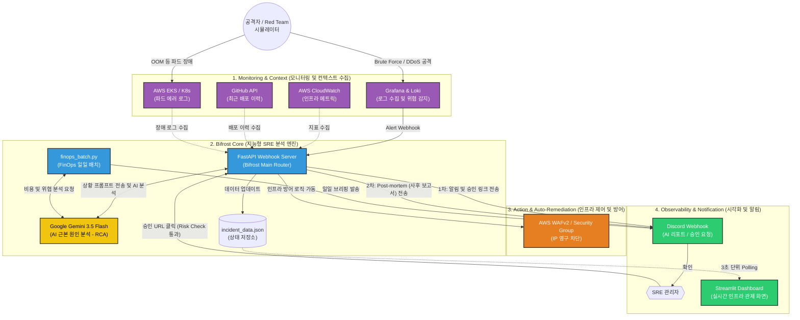

```mermaid
graph TD
    %% 스타일 정의
    classDef ai fill:#f1c40f,stroke:#333,stroke-width:2px,color:#000;
    classDef core fill:#3498db,stroke:#333,stroke-width:2px,color:#fff;
    classDef aws fill:#e67e22,stroke:#333,stroke-width:2px,color:#fff;
    classDef ui fill:#2ecc71,stroke:#333,stroke-width:2px,color:#fff;
    classDef monitoring fill:#9b59b6,stroke:#333,stroke-width:2px,color:#fff;

    %% 액터 및 소스
    Attacker((공격자 / Red Team<br>시뮬레이터))

    subgraph "1. Monitoring & Context (모니터링 및 컨텍스트 수집)"
        Grafana["Grafana & Loki<br>(로그 수집 및 위협 감지)"]:::monitoring
        CloudWatch["AWS CloudWatch<br>(인프라 메트릭)"]:::monitoring
        Github["GitHub API<br>(최근 배포 이력)"]:::monitoring
        EKS["AWS EKS / K8s<br>(파드 에러 로그)"]:::monitoring
    end

    subgraph "2. Bifrost Core (지능형 SRE 분석 엔진)"
        FastAPI["FastAPI Webhook Server<br>(Bifrost Main Router)"]:::core
        Gemini["Google Gemini 3.5 Flash<br>(AI 근본 원인 분석 - RCA)"]:::ai
        JSON[("incident_data.json<br>(상태 저장소)")]
        Batch["finops_batch.py<br>(FinOps 일일 배치)"]:::core
    end

    subgraph "3. Action & Auto-Remediation (인프라 제어 및 방어)"
        WAF["AWS WAFv2 / Security Group<br>(IP 영구 차단)"]:::aws
    end

    subgraph "4. Observability & Notification (시각화 및 알림)"
        Discord["Discord Webhook<br>(AI 리포트 / 승인 요청)"]:::ui
        Admin{{"SRE 관리자"}}
        Streamlit["Streamlit Dashboard<br>(실시간 인프라 관제 화면)"]:::ui
    end

    %% 데이터 흐름 (Flow)
    Attacker -->|"Brute Force / DDoS 공격"| Grafana
    Attacker -->|"OOM 등 파드 장애"| EKS

    Grafana -->|"Alert Webhook"| FastAPI
    
    CloudWatch -.->|"지표 수집"| FastAPI
    Github -.->|"배포 이력 수집"| FastAPI
    EKS -.->|"장애 로그 수집"| FastAPI

    FastAPI <-->|"상황 프롬프트 전송 및 AI 분석"| Gemini
    FastAPI -->|"데이터 업데이트"| JSON
    JSON -.->|"3초 단위 Polling"| Streamlit

    FastAPI -->|"1차: 알림 및 승인 링크 전송"| Discord
    Discord -->|"확인"| Admin
    Admin -->|"승인 URL 클릭 (Risk Check 통과)"| FastAPI

    FastAPI -->|"인프라 방어 로직 가동"| WAF
    FastAPI -->|"2차: Post-mortem (사후 보고서) 전송"| Discord

    Batch <-->|"비용 및 위협 분석 요청"| Gemini
    Batch -->|"일일 브리핑 발송"| Discord
```
