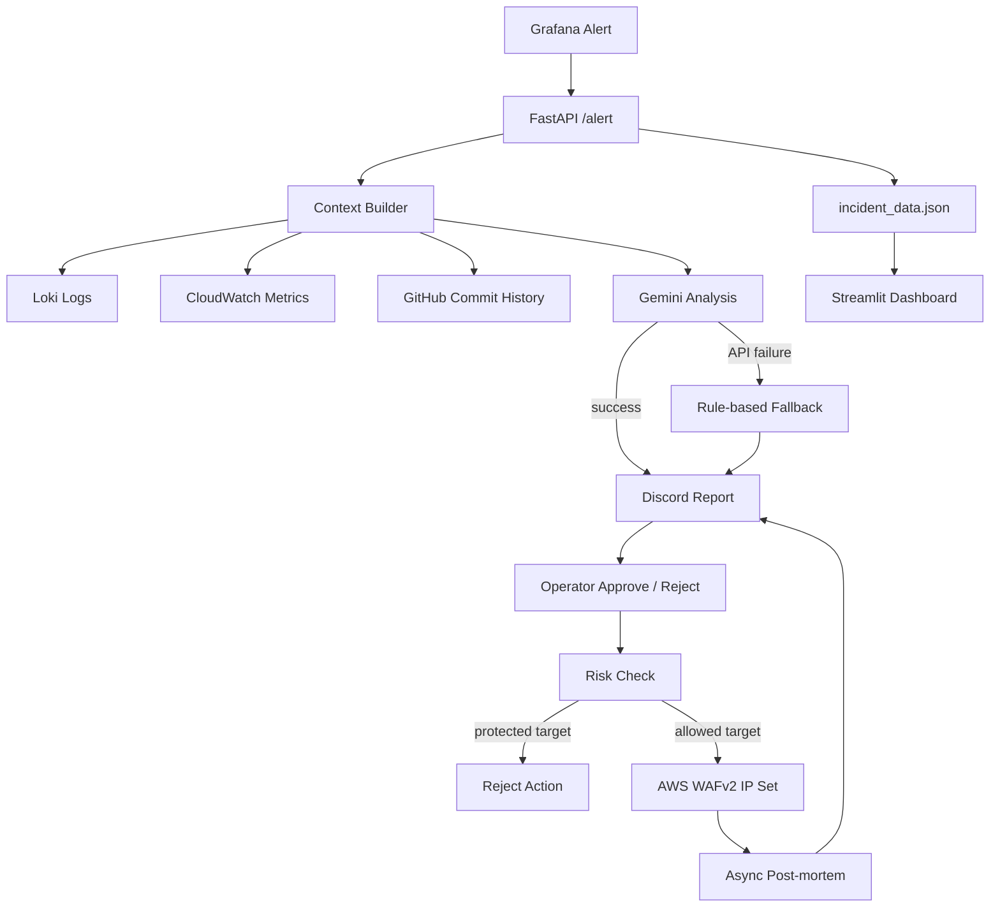

# Bifrost

> Context-Aware SRE & Security Incident Response Platform

Bifrost correlates monitoring and operational signals into a single incident context, assists root-cause analysis with Gemini, and connects the result to a controlled response flow:

**Grafana Alert → FastAPI Webhook → Context Builder → Gemini Analysis → Human Approval → Risk Check → AWS WAFv2 → Post-mortem**

This repository is the implementation evidence for Project 03 in my cloud/SRE portfolio. The design intentionally keeps the AI model out of the final authority path: AI suggests, an operator approves, and a policy guardrail validates the action before infrastructure changes are attempted.

## Why this project

Project 02 focused on controlling external AI API boundaries. The next problem was operational: metrics, logs, deployment history, and security events existed in separate tools, so incident interpretation and response still required manual correlation.

Bifrost addresses that gap by building a context-aware incident pipeline rather than another alert-only bot.

## Architecture



Detailed architecture notes: [`docs/architecture.md`](docs/architecture.md)

## Core engineering decisions

| Problem | Decision | Reason |
|---|---|---|
| Alert alone lacks context | Context Builder | Correlate logs, metrics, and recent deployment history before analysis |
| AI action is unsafe as final authority | Human-in-the-loop approval | Keep infrastructure changes under operator control |
| Operator approval can still be wrong | Risk Check | Reject protected/private targets before remediation |
| Security response needs an explicit IP control point | AWS WAFv2 IP Set | Apply an approved IP-based control through AWS API |
| External LLMs can fail | Rule-based fallback | Keep the incident workflow usable during Gemini failures |
| Incident documentation is repetitive | Async Post-mortem | Record timeline and final action without blocking the approval response |

## Implemented flows

### 1. Alert and context collection

`/alert` receives a Grafana-compatible payload, extracts the alert and target IP, then gathers:

- Loki logs
- CloudWatch EC2 CPU metric
- recent GitHub commit history

The result is written to `incident_data.json` for the dashboard and used as the prompt context for incident analysis.

### 2. AI-assisted RCA with fallback

Gemini produces a concise RCA candidate and action items. If the API is unavailable, Bifrost returns a reduced-fidelity rule-based fallback instead of stopping the incident pipeline.

### 3. Human approval and risk validation

The Discord notification contains approve/reject links. Even after approval, private-network and configured whitelist ranges are rejected by `is_protected_ip()` before remediation is attempted.

### 4. AWS WAFv2 remediation

For an approved, non-protected target, Bifrost updates a configured WAFv2 IP Set. The repository does **not** claim that an IP block is permanent or globally effective; its scope depends on the WAF resource association and runtime configuration.

### 5. Post-mortem

After a successful action, Bifrost asynchronously sends a concise incident timeline and final result to Discord.

### 6. Dashboard

`dashboard.py` visualizes the latest alert, target, CPU metric, analysis, Loki context, deployment history, and current response status.

### 7. Kubernetes recovery validation

`/eks-alert` is an **advanced validation endpoint** for a simulated Pod failure event. Recovery itself belongs to Kubernetes native reconciliation; Bifrost only handles the incident/RCA notification side in this repository.

## Repository structure

```text
.
├── main.py
├── dashboard.py
├── requirements.txt
├── .env.example
├── .gitignore
├── SECURITY.md
├── docs/
│   ├── architecture.md
│   └── troubleshooting.md
└── scripts/
    ├── red_team_simulation.py
    └── eks_event_simulation.py
```

## Configuration

Copy the example environment file and supply your own runtime values.

```bash
cp .env.example .env
pip install -r requirements.txt
uvicorn main:app --host 0.0.0.0 --port 8000
```

Run the dashboard separately:

```bash
streamlit run dashboard.py
```

The repository intentionally contains no real webhook tokens, API keys, AWS access keys, instance identifiers, or public IPs.

## Validation scripts

```bash
python scripts/red_team_simulation.py
python scripts/eks_event_simulation.py
```

The red-team script sends a controlled SSH brute-force **simulation payload** using the documentation-range IP `203.0.113.50`. It does not perform a real attack.

## Reliability cases documented

- Gemini `503 UNAVAILABLE` → fallback analysis path
- Loki empty/non-JSON response → context collection continues without failing the entire pipeline
- Discord approval URL rendering → raw URL form used for reliable operator access

See [`docs/troubleshooting.md`](docs/troubleshooting.md).

## Limitations

- Approval links are a prototype interaction model and should be replaced with authenticated, signed, HTTPS-protected actions in production.
- The current risk policy is IP/range based and does not model ownership, service criticality, or business context.
- `incident_data.json` is local single-node state, not a durable or highly available incident store.
- LLM output is advisory and can be incomplete or wrong; fallback mode preserves workflow continuity, not equivalent analysis quality.
- IP-based WAF remediation is intentionally narrow and is not a general incident-remediation engine.
- Kubernetes recovery in this repository is represented as validation/simulation; native Kubernetes controllers are responsible for recovery.

## Security

See [`SECURITY.md`](SECURITY.md). If a secret was ever committed in an older revision, revoking/rotating it is required even if the current branch no longer contains it.

## Portfolio documentation

Full engineering narrative, screenshots, decisions, validation, and limitations:

**Notion — Project 03 Bifrost**  
https://app.notion.com/p/Bifrost-AI-SRE-3ac59c94122580c8a70fd95e76cf7b71

---

### Portfolio journey

**Project 01 — BUILD → Project 02 — SECURE → Project 03 — OBSERVE & RESPOND → Project 04 — AUTOMATE**
