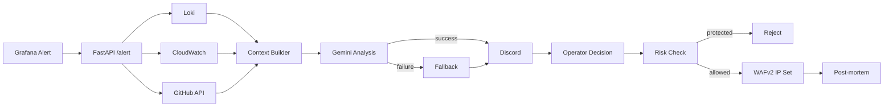

# Architecture

## Core pipeline

## Component responsibilities

### FastAPI
Receives alert events and orchestrates context collection, analysis, operator decision, risk validation, remediation, and post-mortem creation.

### Context Builder
Combines three independent operational signals:

- Loki logs
- CloudWatch CPU metrics
- recent GitHub commit history

The goal is correlation, not proof of causality. These signals are passed to the analysis layer as incident context.

### Gemini
Generates an RCA candidate and recommended actions. The model is advisory and never owns the final infrastructure decision.

### Human-in-the-loop
Discord carries the analysis and approve/reject actions. The operator remains in the decision path.

### Risk Check
Private and protected address ranges are rejected even after operator approval. This is a narrow guardrail, not a complete policy engine.

### AWS WAFv2
When configured, the service retrieves the current IP Set with its lock token and appends an approved `/32` address. Effective blocking depends on how that IP Set is associated with WAF resources.

### Dashboard
Streamlit reads the latest local incident snapshot from `incident_data.json`. This is intentionally simple portfolio evidence, not a durable incident datastore.

## Kubernetes advanced validation

`/eks-alert` accepts a simulated Pod failure event. Kubernetes native controllers remain responsible for replacement/recovery; Bifrost only reports the event and preserves the separation between platform recovery and incident analysis.

## Trust boundaries and production gaps

The current repository demonstrates the response flow, but a production design would require:

- authenticated and signed approval actions
- HTTPS and private ingress where appropriate
- durable incident/event storage
- workload identity and scoped IAM policies
- stronger asset-aware policy evaluation
- queueing/retry/idempotency for external dependencies
- explicit WAF association and remediation verification
